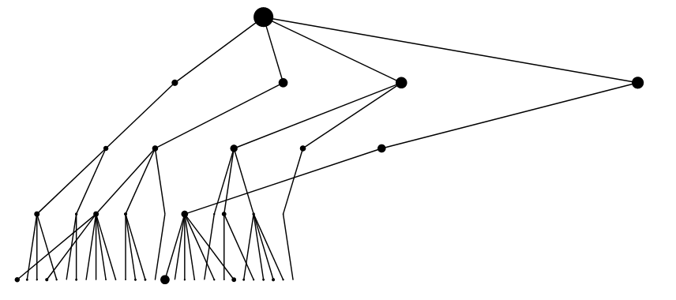

# Extremal linkage network
[This notebook](./simulation.ipynb) provides the Python code for simulating [Extremal linkage networks](https://arxiv.org/abs/2006.00747).

</a>

We define a random network on an infinite set of layers, each consisting of  nodes. The node  in layer  has a fitness , where we assume the family  to be independent and identically distributed (i.i.d.).

Then, the number of nodes on layer   that are visible for the th node in layer  , which we call the *scope* of  , is given by   , where

  

Henceforth, we assume the fitnesses to follow a Fréchet distribution with tail index 1. That is,

 

